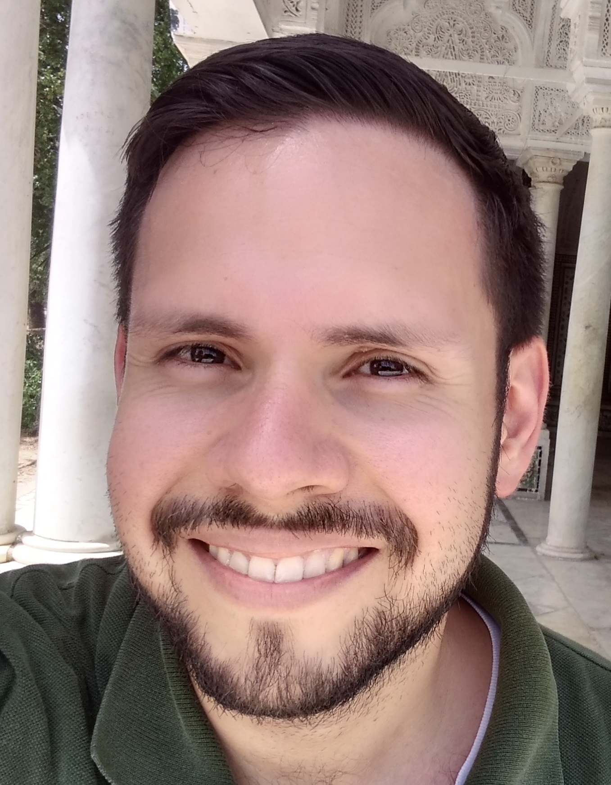

**Jorge A. Garza-Venegas** is a professor at the School of Engineering and Sciences at Tecnologico de Monterrey, Queretaro Campus. He received his Ph.D. in Engineering Sciences from Tecnologico de Monterrey in 2018 and his Master of Sc. from Universidad Autonoma de Nuevo Leon (UANL) in 2013. He made a research stay at Insitut Universitaire de Technologie de Nantes, collaborating with Professor Philippe Castagliola. He has taught more than 30 undergraduate courses at UANL and Tecnologico de Monterrey.

**Institution**: Tecnologico de Monterrey, Santiago de Querétaro, Querétaro, México

**Keywords**: Statistical Process Monitoring, parametric statistics, time series analysis, change-point analysis.

**Pages**: [Curriculum Vitae](CV_JAGV.html), [Researchgate](https://www.researchgate.net/profile/Jorge_Garza_Venegas?ev=hdr_xprf), [Google Scholar profile](https://scholar.google.com/citations?user=8ODrYesAAAAJ&hl=en), [Expert Core](https://research.tec.mx/vivo-tec/display/PID_248814), [Linkedin](https://www.linkedin.com/in/jorge-arturo-b89469176/)

***
Back to [QREMonterrey](../). Looking for someone else? Go to [members](../members.html).
